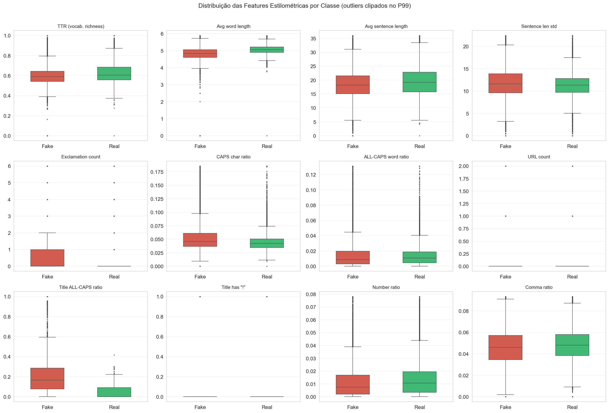
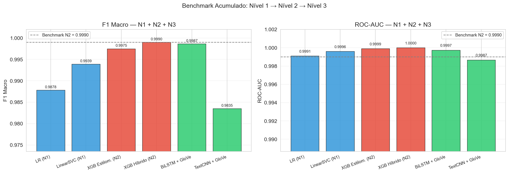
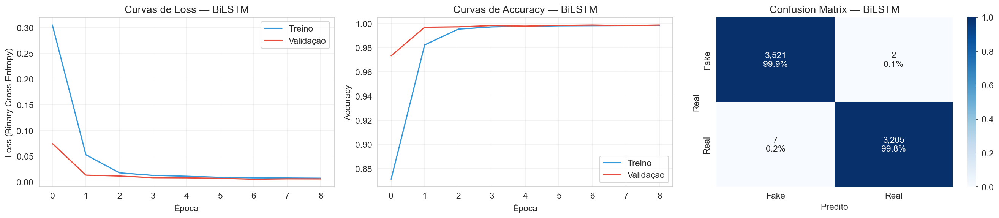
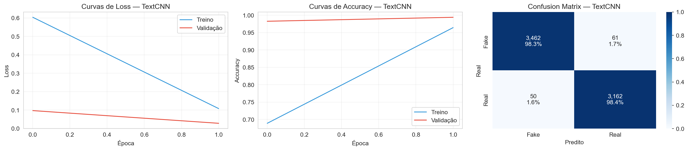

# Newsguard NLP

> **Detecção automática de fake news com modelos de NLP progressivamente complexos — do TF-IDF clássico ao fine-tuning de transformers.**

---

## A História

Todos os dias, milhões de artigos jornalísticos circulam online. Alguns são fatos cuidadosamente apurados. Outros são fabricados para manipular, provocar ou enganar. O desafio: **uma máquina consegue aprender a diferença — e explicar o seu raciocínio?**

Este projeto enfrenta essa questão através de uma pipeline progressiva de modelos de NLP, onde cada camada é mais sofisticada que a anterior. Começamos pela abordagem mais simples possível e evoluímos, sempre perguntando: *a complexidade adicional realmente se justifica?*

O dataset cobre **~45.000 artigos de política americana** entre 2015 e 2017 — um período de intensa polarização midiática em torno das eleições americanas. Artigos reais vêm da Reuters; os falsos, de sites de desinformação catalogados.

Antes de treinar qualquer modelo, identificamos duas armadilhas críticas de **data leakage** escondidas no dataset — o tipo que infla métricas no papel enquanto produz modelos inúteis na prática. Identificá-las e neutralizá-las é o primeiro ato da história.

---

## Pipeline

| Nível | Abordagem | Status |
|-------|-----------|--------|
| **1** | TF-IDF + Regressão Logística + LinearSVC | ✅ Concluído |
| **2** | Features Estilométricas + XGBoost + SHAP | ✅ Concluído |
| **3** | BiLSTM + GloVe / TextCNN | ✅ Concluído |
| 4 | DistilBERT / RoBERTa Fine-tuning | 🔜 Planejado |
| 5 | Ensemble Heterogêneo | 🔜 Planejado |

---

## Nível 1 — TF-IDF + Modelos Lineares

### A Abordagem

O texto é convertido em vetores esparsos de alta dimensão via **TF-IDF** (Term Frequency–Inverse Document Frequency) e alimentado em dois classificadores lineares:

- **Regressão Logística** — modelo probabilístico com saída calibrada e coeficientes interpretáveis
- **LinearSVC** — classificador de máxima margem, convergência rápida, regularização mais forte

Ambos usam `ngram_range=(1,2)` — capturando não apenas palavras individuais, mas bigramas como *"fake news"*, *"breaking news"*, *"white house"* — com 100.000 features e escala logarítmica do TF.

### Data Leakage — As Armadilhas Ocultas

Duas fontes de vazamento foram identificadas e neutralizadas antes do treinamento:

**1. Byline Reuters (sinal de 99,82%)**
Artigos reais da Reuters sempre começam com `"CIDADE (Reuters) -"`. Qualquer modelo bag-of-words aprende trivialmente `reuters → real` — um atalho que falharia completamente em dados do mundo real.

**2. Coluna `subject` (sinal de 100%)**
As categorias de metadados são mutuamente exclusivas entre as classes (`left-news`, `Government News` nos fakes vs. `politicsNews`, `worldnews` nos reais). Um classificador ingênuo usando apenas essa coluna alcança acurácia perfeita — sem ler uma única palavra.

Ambas foram removidas. O impacto quantificado: manter o leakage infla o F1 em **+0,64 pp** — modesto em termos absolutos, mas construído sobre uma mentira.

### Resultados

Avaliação no conjunto de teste com **6.735 artigos** (15% dos dados), split estratificado, sem leakage.

| Modelo | Accuracy | F1 Macro | ROC-AUC | Tempo de Treino |
|--------|----------|----------|---------|-----------------|
| Regressão Logística | 0,9878 | **0,9878** | **0,9991** | 0,70s |
| LinearSVC | 0,9939 | **0,9939** | **0,9997** | 3,94s |

Validação cruzada 5-fold no conjunto de treino:

| Modelo | Accuracy CV | F1 Macro CV |
|--------|-------------|-------------|
| Regressão Logística | 0,9865 ± 0,0018 | 0,9865 ± 0,0018 |
| LinearSVC | 0,9941 ± 0,0010 | 0,9941 ± 0,0010 |

**LinearSVC vence** em todas as métricas e apresenta menor variância entre os folds — generalização mais estável. Ambos os modelos treinam em menos de 4 segundos na CPU.

### Análise Exploratória


Principais achados da EDA:
- Classes quase balanceadas: **52,3% fake / 47,7% real**
- Artigos falsos têm distribuição de comprimento mais ampla — maior variância de estilo
- Títulos de fake news são significativamente mais longos em média (94 chars vs. 64 chars) — indício de comportamento clickbait

### Avaliação dos Modelos

**Regressão Logística**


**LinearSVC**


### Comparação dos Modelos


Ambas as curvas ROC abraçam o canto superior esquerdo — AUC > 0,999. A visão com zoom revela que o LinearSVC mantém uma leve vantagem em taxas baixas de falsos positivos, a região operacionalmente mais crítica.

### O que o Modelo Aprendeu — Interpretabilidade


Os coeficientes contam uma história clara:

**Notícias reais** → linguagem formal, atributiva, institucional:
`said`, `reuters`, `president donald`, nomes de países, verbos de atribuição

**Notícias falsas** → linguagem emocional, polarizadora, sensacionalista:
termos políticos carregados, enquadramento informal, linguagem de urgência e indignação

> Nota: `reuters` ainda aparece como top feature para notícias reais mesmo após a remoção da byline — porque a Reuters é citada pelo nome ao longo do corpo dos artigos reais (*"according to Reuters"*). Esse sinal residual é inevitável sem filtragem agressiva de conteúdo.

---

## Nível 2 — Feature Engineering Estilométrico + XGBoost

### A Hipótese

O Nível 1 aprendeu *o quê* está escrito — o vocabulário. Mas notícias falsas e verdadeiras diferem também em *como* estão escritas: pontuação, capitalização, estrutura de sentenças, riqueza de vocabulário. Essas dimensões são completamente invisíveis para o TF-IDF, que destrói toda pontuação e ordem.

**Estilometria** é o estudo quantitativo do estilo de escrita. Originalmente usada para análise de autoria literária, aplica-se aqui para capturar o contraste entre o jornalismo formal da Reuters e o estilo emocional/sensacionalista dos sites de desinformação.

### As 23 Features Estilométricas

| Grupo | Features (8) | Diferença medida |
|-------|-------------|-----------------|
| **Riqueza Lexical** | TTR, comprimento médio de palavra | TTR: 0,627 real vs 0,596 fake (+5%) |
| **Estrutura de Sentenças** | contagem, comprimento médio, desvio padrão | Sentenças reais ~8% mais longas |
| **Pontuação & Emoção** | exclamações, interrogações, reticências, aspas, vírgulas, números, URLs | Exclamações: 0,72 fake vs 0,06 real (−91%) |
| **Capitalização** | ratio de chars CAPS, ratio de palavras ALL-CAPS | CAPS char ratio: 5,73% fake vs 4,42% real |
| **Título** | comprimento, CAPS ratio, palavras ALL-CAPS, `!`, `?`, comprimento médio de palavra, ratio título/texto | Title CAPS ratio: **36,4% fake vs 6,7% real** |

### EDA Estilométrica



Os box plots confirmam que as diferenças mais marcantes estão no **título**, não no corpo:

- `title_caps_word_ratio`: **21,1% das palavras em ALL CAPS** nos títulos falsos vs 3,8% nos reais
- `title_has_exclamation`: **13,9% dos títulos falsos** têm `!` vs apenas 0,08% dos reais
- `url_count`: artigos falsos têm **91× mais URLs** no corpo (0,20 vs 0,002 por artigo)
- `quote_count`: artigos reais têm **32× mais aspas** — atribuição direta de falas (estilo Reuters)

### Por que XGBoost?

Features estilométricas são heterogêneas — contagens, ratios, booleanos — com distribuições e escalas completamente diferentes. O **XGBoost** (gradient boosting com regularização) é a escolha natural porque:
- Árvores de decisão são invariantes a escala (sem normalização necessária)
- Capturam interações não-lineares: *CAPS alto* **e** *título longo* → quase certamente fake
- Implementam TreeSHAP nativamente para explicações exatas por predição

### Dois Modelos

- **Modelo A — XGBoost Estilométrico (23 features):** estilo puro, sem nenhuma informação de vocabulário. Responde: *"o jeito de escrever sozinho basta?"*
- **Modelo B — XGBoost Híbrido (TF-IDF 15k + 23 features):** combina as 15.000 features de vocabulário mais discriminativas com todas as features de estilo

> TF-IDF limitado a 15k porque XGBoost com árvores varre todas as features candidatas em cada split — 100k features esparsas tornam a CV inviável (>10 min/fold). Modelos lineares como o LinearSVC exploram espaços TF-IDF de 100k com muito mais eficiência.

### Resultados

| Modelo | Features | F1 Macro | ROC-AUC | CV 5-fold | Treino |
|--------|----------|----------|---------|-----------|--------|
| XGBoost Estilométrico | 23 de estilo | **0,9975** | **0,9999** | 0,9977 ± 0,0009 | 1,5s |
| XGBoost Híbrido | TF-IDF (15k) + 23 | **0,9990** | **1,0000** | — | 171s |

O modelo híbrido supera o benchmark do Nível 1 (LinearSVC F1=0,9939) em **+0,51 pp**.

Destaque: o Modelo A — com apenas 23 features numéricas e sem nenhuma palavra do texto — já supera a Regressão Logística do Nível 1 que usa 100k features TF-IDF. O estilo de escrita, isolado, é um sinal extremamente forte.

### Análise SHAP

Shapley values calculados via `pred_contribs` nativo do XGBoost (algoritmo TreeSHAP exato, sem aproximação).


| Feature | \|SHAP\| médio | Direção | Interpretação |
|---------|--------------|---------|---------------|
| `title_caps_ratio` | **6,85** | → Fake | Feature dominante por larga margem: 36% CAPS nos títulos falsos vs 6,7% nos reais |
| `title_char_count` | 1,50 | → Fake | Títulos falsos ~46% mais longos (94 vs 65 chars) — clickbait verboso |
| `quote_count` | 0,86 | → Real | Reuters cita fontes com aspas diretas — ausente em fake news |
| `question_count` | 0,64 | → Fake | Perguntas retóricas ("Será que X está escondendo Y?") |
| `title_caps_word_ratio` | 0,63 | → Fake | Palavras ALL CAPS nos títulos como sinal de alerta |

O `title_caps_ratio` domina com SHAP médio de 6,85 — **10× maior que a segunda feature**. Isso confirma que capitalização excessiva nos títulos é o marcador estilístico mais forte de fake news neste dataset.

### Avaliação dos Modelos

**XGBoost Estilométrico (23 features)**


**XGBoost Híbrido (TF-IDF 15k + 23 features)**


### Benchmark Acumulado — Nível 1 vs Nível 2


| Modelo | Nível | F1 Macro | ROC-AUC |
|--------|-------|----------|---------|
| Regressão Logística | 1 | 0,9878 | 0,9991 |
| LinearSVC | 1 | 0,9939 | 0,9996 |
| XGBoost Estilométrico | 2-A | 0,9975 | 0,9999 |
| **XGBoost Híbrido** | **2-B** | **0,9990** | **1,0000** |

---

## Nível 3 — BiLSTM + GloVe / TextCNN

### A Hipótese

Os Níveis 1 e 2 tratam o texto como um **saco de palavras** — ignora completamente a ordem em que as palavras aparecem. Para o TF-IDF, *"Trump acusou Biden"* e *"Biden acusou Trump"* produzem vetores idênticos.

O Nível 3 explora a **estrutura sequencial** do texto com dois modelos que operam sobre representações densas (word embeddings) em vez de vetores esparsos.

### GloVe — Embeddings Pré-treinados

Os vetores **GloVe 6B.100d** (Pennington et al., 2014) foram treinados em 6 bilhões de tokens da Wikipedia e Gigaword. Cada palavra é mapeada para um vetor de 100 dimensões onde **proximidade = similaridade semântica**:

$$\vec{\text{king}} - \vec{\text{man}} + \vec{\text{woman}} \approx \vec{\text{queen}}$$

Cobertura no vocabulário do corpus: **96,3%** das 30.000 palavras mais frequentes possuem vetor GloVe.

### Dois Modelos

**Modelo A — BiLSTM + GloVe**

O BiLSTM processa a sequência em **duas direções** — da esquerda para a direita e da direita para a esquerda — capturando dependências de longo alcance que RNNs simples perdem. Cada célula LSTM usa três gates (forget, input, output) para controlar o fluxo de informação ao longo da sequência.

```
Embedding GloVe (frozen) → SpatialDropout(0.3) → BiLSTM(64) → Dense(64) → σ
```

**Modelo B — TextCNN + GloVe**

O TextCNN (Kim, 2014) aplica convoluções 1D em paralelo com 3 tamanhos de filtro (k=2,3,4) detectando bigramas, trigramas e quadrigramas semânticos. O global max-pooling torna o modelo invariante à posição — um padrão de fake news é detectado independente de onde aparece no artigo.

```
Embedding GloVe (frozen) → Conv1D(k=2,3,4 × 128 filtros) → GlobalMaxPool → Concat → σ
```

### Resultados

| Modelo | F1 Macro | ROC-AUC | Erros no teste | Treino |
|--------|----------|---------|----------------|--------|
| **BiLSTM + GloVe** | **0,9987** | **0,9997** | 9 / 6.735 | ~10 min (CPU) |
| TextCNN + GloVe | 0,9835 | 0,9987 | 110 / 6.735 | ~3 min (CPU) |

O BiLSTM errou apenas **9 artigos em 6.735** — 0,13% de erro no conjunto de teste.

### Análise de Erros — BiLSTM

Com apenas 9 erros, cada caso é informativo:

**Falsos Positivos (Fake → predito Real):** artigos falsos que imitam o estilo Reuters — mencionam "Reuters" explicitamente no título (*"WHY REUTERS IS SAYING..."*) ou usam linguagem formal atípica para fake news. O modelo, treinado em texto pré-processado, foi confundido pelo mesmo sinal que usamos para prevenir data leakage.

**Falsos Negativos (Real → predito Fake):** artigos da Reuters com títulos curtos e diretos (*"Obama knocks Trump, voices optimism"*, *"Clinton says Trump is most divisive..."*) — manchetes telegráficas sem a estrutura narrativa longa típica dos artigos reais. O modelo classificou com base no padrão de uma frase curta e polarizadora — semelhante ao estilo de fake news clickbait.

### Benchmark Acumulado — Nível 1 + Nível 2 + Nível 3



| Modelo | Nível | F1 Macro | ROC-AUC |
|--------|-------|----------|---------|
| Regressão Logística | 1 | 0,9878 | 0,9991 |
| LinearSVC | 1 | 0,9939 | 0,9996 |
| XGBoost Estilométrico | 2-A | 0,9975 | 0,9999 |
| XGBoost Híbrido | 2-B | **0,9990** | 1,0000 |
| **BiLSTM + GloVe** | **3-A** | **0,9987** | 0,9997 |
| TextCNN + GloVe | 3-B | 0,9835 | 0,9987 |

O BiLSTM (0,9987) ficou a **0,03 pp** do XGB Híbrido (0,9990) — diferença de 3 erros em 6.735 artigos. A sequência temporal do texto não forneceu vantagem significativa sobre a abordagem híbrida estilo+vocabulário do Nível 2.

O TextCNN (0,9835) ficou aquém — a convolução com embeddings estáticos captura menos informação contextual que o LSTM. Com embeddings contextuais (Nível 4), essa limitação desaparece.

### Avaliação dos Modelos

**BiLSTM + GloVe**



**TextCNN + GloVe**



---

## Estrutura do Projeto

```
newsguard-nlp/
│
├── data/                    # CSVs do dataset (não versionados — baixar do Kaggle)
│   ├── Fake.csv
│   └── True.csv
│
├── notebooks/               # Um notebook por nível da pipeline
│   ├── 01_baseline_tfidf_linear_models.ipynb
│   └── 02_stylometric_xgboost.ipynb
│
├── results/                 # Figuras salvas, organizadas por nível
│   ├── level1/
│   │   ├── eda_overview.png
│   │   ├── lr_evaluation.png
│   │   ├── svm_evaluation.png
│   │   ├── model_comparison.png
│   │   └── feature_importance.png
│   └── level2/
│       ├── eda_stylometric.png
│       ├── xgb_stylometric_evaluation.png
│       ├── xgb_hybrid_evaluation.png
│       ├── shap_beeswarm.png
│       ├── shap_importance.png
│       └── model_comparison.png
│
├── models/                  # Modelos serializados (.pkl / .joblib)
│
├── .gitignore
├── requirements.txt
└── README.md
```

---

## Como Executar

```bash
# 1. Clonar o repositório
git clone https://github.com/Filip3Owl/Newsguard-Nlp.git
cd Newsguard-Nlp

# 2. Criar o ambiente virtual
python3 -m venv venv
source venv/bin/activate        # macOS/Linux
# venv\Scripts\activate         # Windows

# 3. Instalar dependências
pip install -r requirements.txt

# 4. Registrar o kernel Jupyter
python3 -m ipykernel install --user --name "fakenews-venv" --display-name "Python (fakeNews)"

# 5. Baixar o dataset
# → https://www.kaggle.com/clmentbisaillon/fake-and-real-news-dataset
# Salvar em: data/Fake.csv e data/True.csv

# 6. Abrir o notebook desejado
jupyter notebook notebooks/01_baseline_tfidf_linear_models.ipynb
jupyter notebook notebooks/02_stylometric_xgboost.ipynb
```

Ao abrir, selecionar o kernel **"Python (fakeNews)"**.

---

## Referências

- Pedregosa, F. et al. (2011). *Scikit-learn: Machine Learning in Python*. JMLR, 12, 2825–2830.
- Joachims, T. (1998). *Text Categorization with Support Vector Machines*. ECML.
- Salton, G. & Buckley, C. (1988). *Term-weighting approaches in automatic text retrieval*. Information Processing & Management.
- Chen, T. & Guestrin, C. (2016). *XGBoost: A Scalable Tree Boosting System*. KDD.
- Lundberg, S.M. & Lee, S. (2017). *A Unified Approach to Interpreting Model Predictions*. NeurIPS.
- Rashkin, H. et al. (2017). *Truth of Varying Shades: Analyzing Language in Fake News*. EMNLP.
- Devlin, J. et al. (2019). *BERT: Pre-training of Deep Bidirectional Transformers*. NAACL.
- Reuters Institute Digital News Report (2023). University of Oxford.
