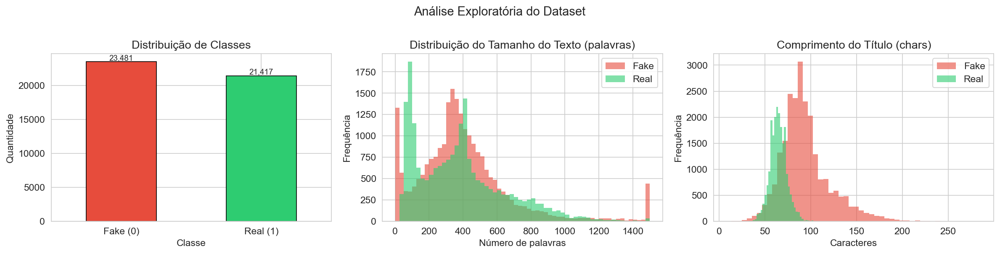
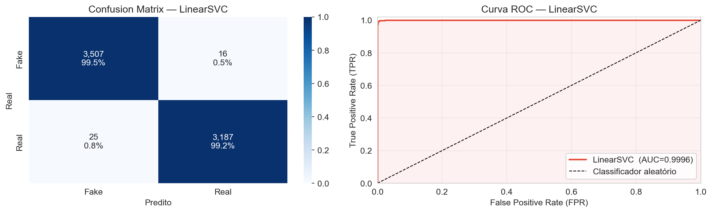
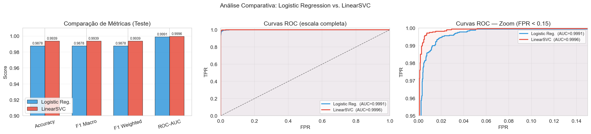
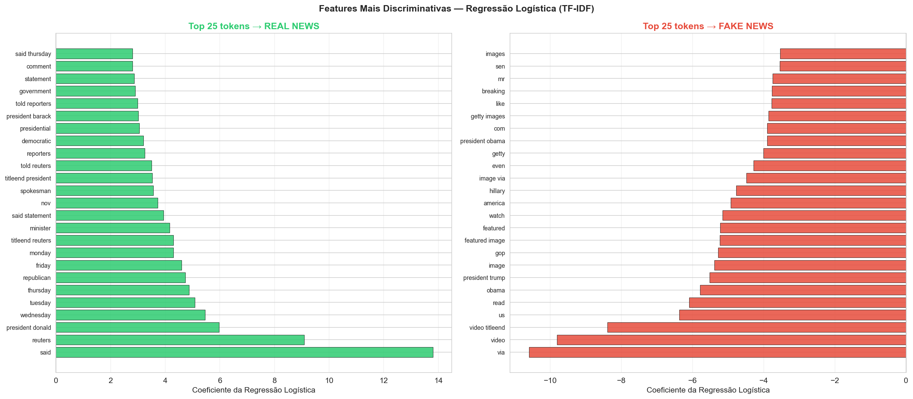
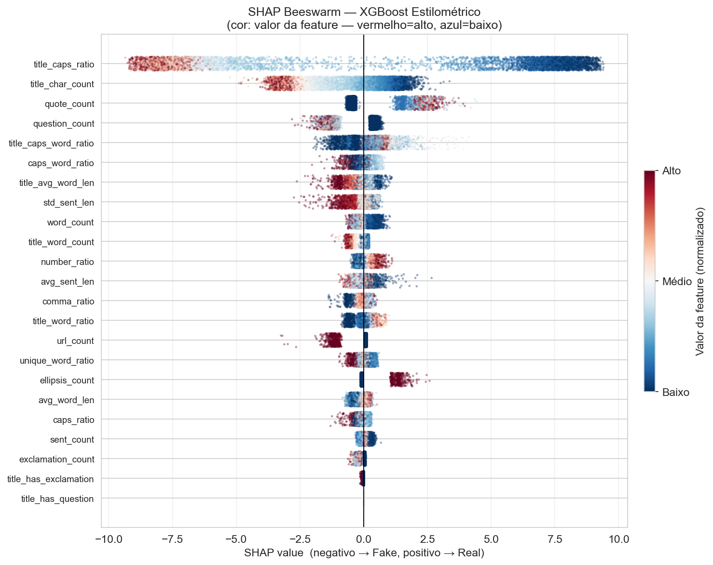
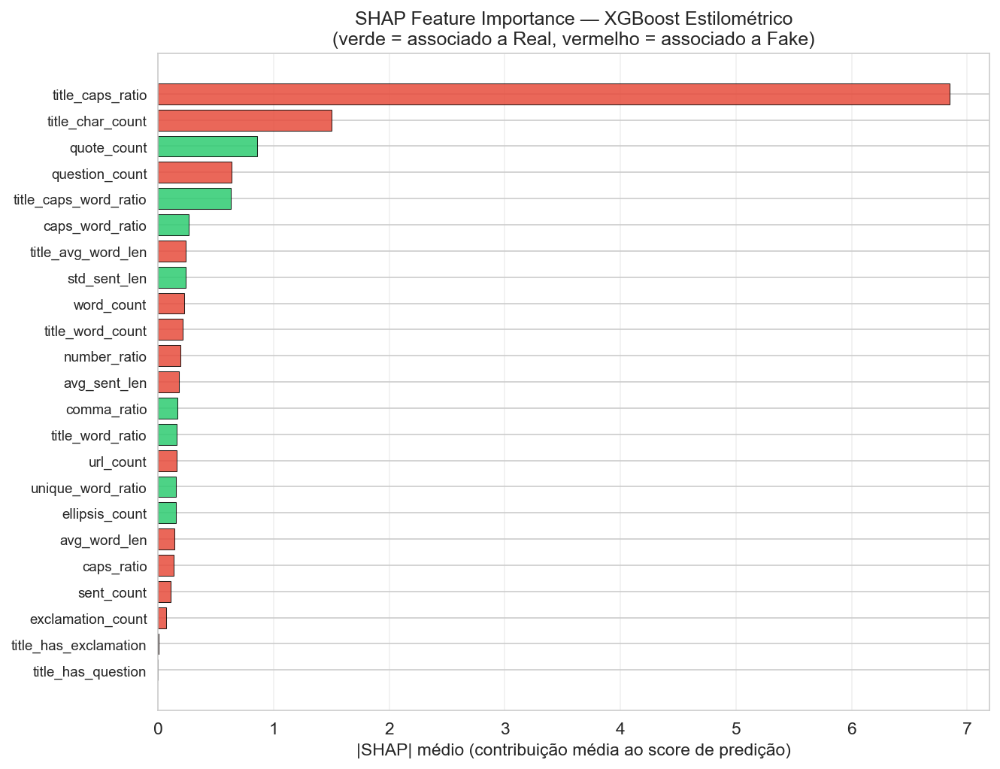
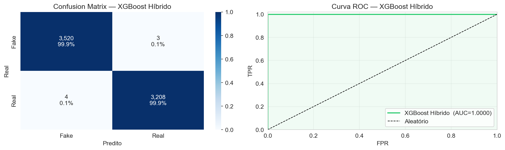
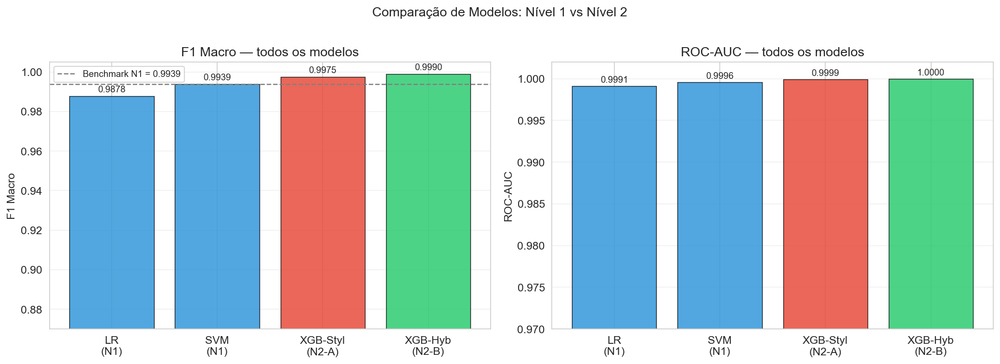

# Newsguard NLP

> **Detecção automática de fake news com modelos de NLP progressivamente complexos — do TF-IDF clássico ao fine-tuning de transformers.**

---

## A História

Todos os dias, milhões de artigos jornalísticos circulam online. Alguns são fatos cuidadosamente apurados. Outros são fabricados para manipular, provocar ou enganar. O desafio: **uma máquina consegue aprender a diferença — e explicar o seu raciocínio?**

Este projeto enfrenta essa questão através de uma pipeline progressiva de modelos de NLP, onde cada camada é mais sofisticada que a anterior. Começamos pela abordagem mais simples possível e evoluímos, sempre perguntando: *a complexidade adicional realmente se justifica?*

O dataset cobre **~45.000 artigos de política americana** entre 2015 e 2017 — um período de intensa polarização midiática em torno das eleições americanas. Artigos reais vêm da Reuters; os falsos, de sites de desinformação catalogados.

Antes de treinar qualquer modelo, identificamos duas armadilhas críticas de **data leakage** escondidas no dataset — o tipo que infla métricas no papel enquanto produz modelos inúteis na prática. Identificá-las e neutralizá-las é o primeiro ato da história.

---

## Pipeline

| Nível | Abordagem | Status |
|-------|-----------|--------|
| **1** | TF-IDF + Regressão Logística + LinearSVC | ✅ Concluído |
| **2** | Features Estilométricas + XGBoost + SHAP | ✅ Concluído |
| 3 | BiLSTM + GloVe / TextCNN | 🔜 Próximo |
| 4 | DistilBERT / RoBERTa Fine-tuning | 🔜 Planejado |
| 5 | Ensemble Heterogêneo | 🔜 Planejado |

---

## Nível 1 — TF-IDF + Modelos Lineares

### A Abordagem

O texto é convertido em vetores esparsos de alta dimensão via **TF-IDF** (Term Frequency–Inverse Document Frequency) e alimentado em dois classificadores lineares:

- **Regressão Logística** — modelo probabilístico com saída calibrada e coeficientes interpretáveis
- **LinearSVC** — classificador de máxima margem, convergência rápida, regularização mais forte

Ambos usam `ngram_range=(1,2)` — capturando não apenas palavras individuais, mas bigramas como *"fake news"*, *"breaking news"*, *"white house"* — com 100.000 features e escala logarítmica do TF.

### Data Leakage — As Armadilhas Ocultas

Duas fontes de vazamento foram identificadas e neutralizadas antes do treinamento:

**1. Byline Reuters (sinal de 99,82%)**
Artigos reais da Reuters sempre começam com `"CIDADE (Reuters) -"`. Qualquer modelo bag-of-words aprende trivialmente `reuters → real` — um atalho que falharia completamente em dados do mundo real.

**2. Coluna `subject` (sinal de 100%)**
As categorias de metadados são mutuamente exclusivas entre as classes (`left-news`, `Government News` nos fakes vs. `politicsNews`, `worldnews` nos reais). Um classificador ingênuo usando apenas essa coluna alcança acurácia perfeita — sem ler uma única palavra.

Ambas foram removidas. O impacto quantificado: manter o leakage infla o F1 em **+0,64 pp** — modesto em termos absolutos, mas construído sobre uma mentira.

### Resultados

Avaliação no conjunto de teste com **6.735 artigos** (15% dos dados), split estratificado, sem leakage.

| Modelo | Accuracy | F1 Macro | ROC-AUC | Tempo de Treino |
|--------|----------|----------|---------|-----------------|
| Regressão Logística | 0,9878 | **0,9878** | **0,9991** | 0,70s |
| LinearSVC | 0,9939 | **0,9939** | **0,9997** | 3,94s |

Validação cruzada 5-fold no conjunto de treino:

| Modelo | Accuracy CV | F1 Macro CV |
|--------|-------------|-------------|
| Regressão Logística | 0,9865 ± 0,0018 | 0,9865 ± 0,0018 |
| LinearSVC | 0,9941 ± 0,0010 | 0,9941 ± 0,0010 |

**LinearSVC vence** em todas as métricas e apresenta menor variância entre os folds — generalização mais estável. Ambos os modelos treinam em menos de 4 segundos na CPU.

### Análise Exploratória



Principais achados da EDA:
- Classes quase balanceadas: **52,3% fake / 47,7% real**
- Artigos falsos têm distribuição de comprimento mais ampla — maior variância de estilo
- Títulos de fake news são significativamente mais longos em média (94 chars vs. 64 chars) — indício de comportamento clickbait

### Avaliação dos Modelos

**Regressão Logística**


**LinearSVC**



### Comparação dos Modelos



Ambas as curvas ROC abraçam o canto superior esquerdo — AUC > 0,999. A visão com zoom revela que o LinearSVC mantém uma leve vantagem em taxas baixas de falsos positivos, a região operacionalmente mais crítica.

### O que o Modelo Aprendeu — Interpretabilidade



Os coeficientes contam uma história clara:

**Notícias reais** → linguagem formal, atributiva, institucional:
`said`, `reuters`, `president donald`, nomes de países, verbos de atribuição

**Notícias falsas** → linguagem emocional, polarizadora, sensacionalista:
termos políticos carregados, enquadramento informal, linguagem de urgência e indignação

> Nota: `reuters` ainda aparece como top feature para notícias reais mesmo após a remoção da byline — porque a Reuters é citada pelo nome ao longo do corpo dos artigos reais (*"according to Reuters"*). Esse sinal residual é inevitável sem filtragem agressiva de conteúdo.

---

## Nível 2 — Feature Engineering Estilométrico + XGBoost

### A Hipótese

O Nível 1 aprendeu *o quê* está escrito — o vocabulário. Mas notícias falsas e verdadeiras diferem também em *como* estão escritas: pontuação, capitalização, densidade de sentenças, riqueza de vocabulário. Essas dimensões são invisíveis para o TF-IDF.

**Estilometria** é o estudo quantitativo do estilo de escrita. Aplicada aqui, transforma características textuais em features numéricas independentes do vocabulário — capturando o estilo jornalístico formal da Reuters versus o estilo emocional/sensacionalista dos sites de desinformação.

### As 22 Features Estilométricas

| Grupo | Features | Intuição |
|-------|----------|----------|
| **Riqueza Lexical** | TTR (type-token ratio), comprimento médio de palavra | Reuters usa vocabulário diverso e técnico |
| **Estrutura de Sentenças** | contagem, comprimento médio e desvio padrão | Jornalismo formal tem sentenças mais longas e regulares |
| **Pontuação & Emoção** | exclamações, interrogações, reticências, URLs, aspas | Fake news abusa de marcadores de urgência e sensacionalismo |
| **Capitalização** | ratio de caracteres e palavras em CAPS | ALL CAPS é sinal clássico de clickbait |
| **Título** | comprimento, CAPS ratio, presença de `!` e `?` | O título é o principal veículo de manipulação |

### Por que XGBoost?

Features estilométricas são heterogêneas (contagens, ratios, booleans) — modelos lineares tratam todas simetricamente, o que é subótimo. O **XGBoost** usa árvores de decisão sequenciais que:
- São invariantes a escala (não precisam de normalização)
- Capturam interações não-lineares (ex: CAPS alto *e* exclamações → quase certamente fake)
- Integram nativamente com o SHAP TreeExplainer para explicações exatas

### Dois Modelos

- **Modelo A — XGBoost Estilométrico (23 features):** isola o poder do estilo de escrita puro
- **Modelo B — XGBoost Híbrido (TF-IDF 15k + 23 features):** combina vocabulário e estilo para o melhor dos dois mundos

### Resultados

| Modelo | Features | F1 Macro | ROC-AUC | Treino |
|--------|----------|----------|---------|--------|
| XGBoost Estilométrico | 23 features de estilo | **0,9975** | **0,9999** | 1,5s |
| XGBoost Híbrido | TF-IDF (15k) + 23 features | **0,9990** | **1,0000** | 171s |

O modelo híbrido supera o benchmark do Nível 1 (LinearSVC F1=0,9939) em **+0,51 pp**.

Validação cruzada 5-fold do Modelo A: **0,9977 ± 0,0009** — baixa variância, boa generalização.

### Análise SHAP

Os Shapley values (calculados via `pred_contribs` nativo do XGBoost) revelam quais features estilométricas mais discriminam as classes:

| Feature | |SHAP| médio | Direção | Interpretação |
|---------|-----------|---------|---------------|
| `title_caps_ratio` | **6,85** | → Fake | Títulos fake têm 36% de letras MAIÚSCULAS vs 6,7% nos reais |
| `title_char_count` | 1,50 | → Fake | Títulos fake são ~46% mais longos (94 vs 65 chars) |
| `quote_count` | 0,86 | → Real | Reuters usa aspas para atribuição de falas |
| `question_count` | 0,64 | → Fake | Perguntas retóricas como técnica de engajamento |
| `title_caps_word_ratio` | 0,63 | → Fake | Palavras ALL CAPS nos títulos (clickbait) |

O **TreeExplainer** calcula os Shapley values exatos para cada predição — sem aproximação. O beeswarm plot revela como cada feature empurra a predição em direção a Fake ou Real para cada artigo individualmente.





### Avaliação




### Comparação com Nível 1



---

## Estrutura do Projeto

```
newsguard-nlp/
│
├── data/                    # CSVs do dataset (não versionados — baixar do Kaggle)
│   ├── Fake.csv
│   └── True.csv
│
├── notebooks/               # Um notebook por nível da pipeline
│   ├── 01_baseline_tfidf_linear_models.ipynb
│   └── 02_stylometric_xgboost.ipynb
│
├── results/                 # Figuras salvas, organizadas por nível
│   ├── level1/
│   │   ├── eda_overview.png
│   │   ├── lr_evaluation.png
│   │   ├── svm_evaluation.png
│   │   ├── model_comparison.png
│   │   └── feature_importance.png
│   └── level2/
│       ├── eda_stylometric.png
│       ├── xgb_stylometric_evaluation.png
│       ├── xgb_hybrid_evaluation.png
│       ├── shap_beeswarm.png
│       ├── shap_importance.png
│       └── model_comparison.png
│
├── models/                  # Modelos serializados (.pkl / .joblib)
│
├── .gitignore
├── requirements.txt
└── README.md
```

---

## Como Executar

```bash
# 1. Clonar o repositório
git clone https://github.com/Filip3Owl/Newsguard-Nlp.git
cd Newsguard-Nlp

# 2. Criar o ambiente virtual
python3 -m venv venv
source venv/bin/activate        # macOS/Linux
# venv\Scripts\activate         # Windows

# 3. Instalar dependências
pip install -r requirements.txt

# 4. Registrar o kernel Jupyter
python3 -m ipykernel install --user --name "fakenews-venv" --display-name "Python (fakeNews)"

# 5. Baixar o dataset
# → https://www.kaggle.com/clmentbisaillon/fake-and-real-news-dataset
# Salvar em: data/Fake.csv e data/True.csv

# 6. Abrir o notebook desejado
jupyter notebook notebooks/01_baseline_tfidf_linear_models.ipynb
jupyter notebook notebooks/02_stylometric_xgboost.ipynb
```

Ao abrir, selecionar o kernel **"Python (fakeNews)"**.

---

## Referências

- Pedregosa, F. et al. (2011). *Scikit-learn: Machine Learning in Python*. JMLR, 12, 2825–2830.
- Joachims, T. (1998). *Text Categorization with Support Vector Machines*. ECML.
- Salton, G. & Buckley, C. (1988). *Term-weighting approaches in automatic text retrieval*. Information Processing & Management.
- Chen, T. & Guestrin, C. (2016). *XGBoost: A Scalable Tree Boosting System*. KDD.
- Lundberg, S.M. & Lee, S. (2017). *A Unified Approach to Interpreting Model Predictions*. NeurIPS.
- Rashkin, H. et al. (2017). *Truth of Varying Shades: Analyzing Language in Fake News*. EMNLP.
- Devlin, J. et al. (2019). *BERT: Pre-training of Deep Bidirectional Transformers*. NAACL.
- Reuters Institute Digital News Report (2023). University of Oxford.
